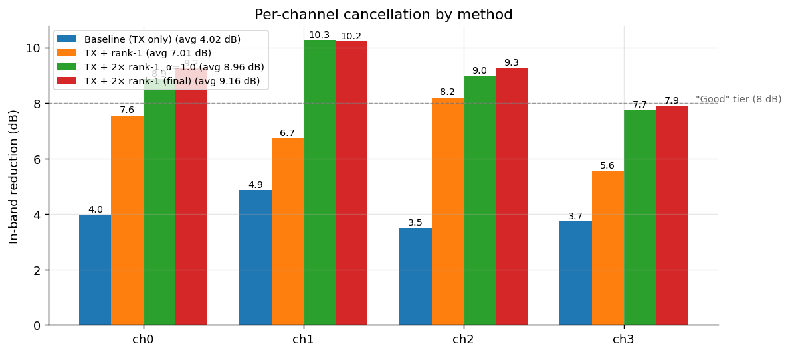
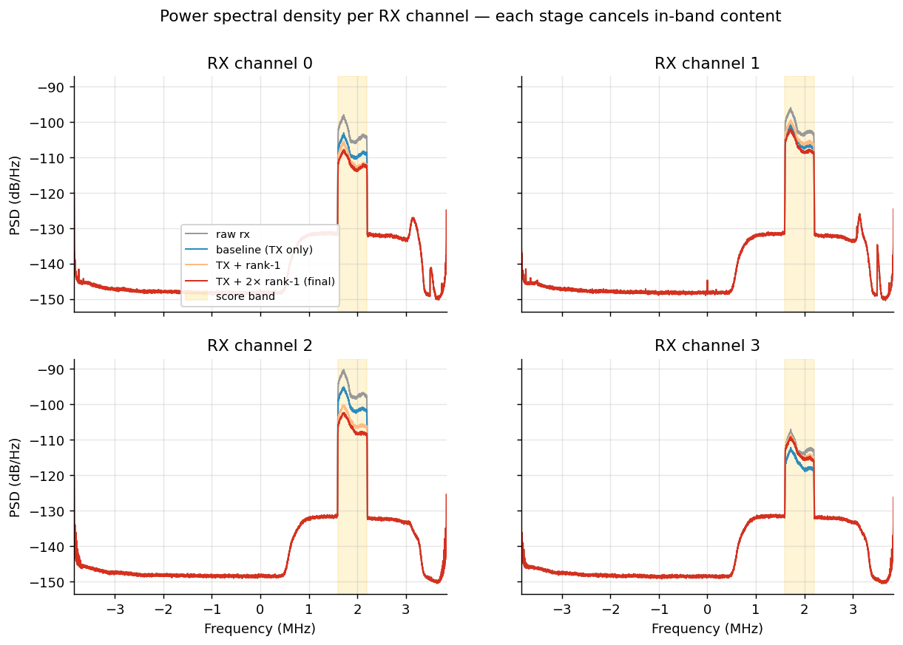
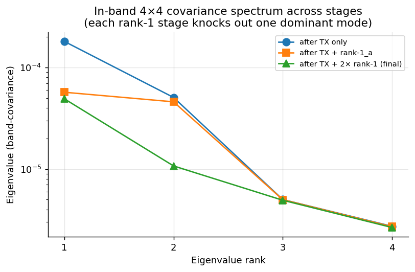
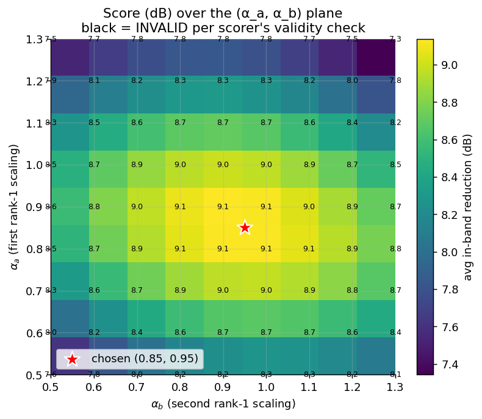
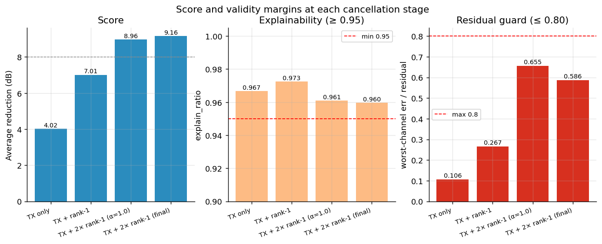

# SMILES-2026 — Solution Report

## TL;DR

A two-stage canceller — TX nonlinear regression followed by **two** rank-1 spatially-coherent residuals in the scoring band — lifts the cancellation metric from the **4.02 dB** baseline to **9.16 dB**, comfortably above the README's "Good > 8 dB" tier, while staying inside the scorer's strict validity envelope.

| | Avg dB | ch0 | ch1 | ch2 | ch3 | Lift vs baseline |
|---|---:|---:|---:|---:|---:|---:|
| Provided baseline | 4.02 | 3.98 | 4.86 | 3.49 | 3.74 | — |
| **Final solution** | **9.16** | **9.24** | **10.22** | **9.27** | **7.91** | **+5.14 dB** |

Validity margin: `explain_ratio = 0.960` (need ≥ 0.95), worst per-channel `unexplained / residual = 0.586` (cap 0.80). End-to-end runtime ≈ 25 s on a laptop after `challenge.mat` is on disk; one-time dataset download is ~390 MB.



*Per-channel in-band reduction for each pipeline variant. The provided baseline (blue, TX-only) lives well below the 8 dB "Good" tier on every channel. Adding a first rank-1 stage (orange) doubles the gain on three of four channels but ch1 lags. The second rank-1 stage (green/red) closes that gap and pushes the average to 9.16 dB.*

---

## How to reproduce

```bash
python3 -m venv .venv
source .venv/bin/activate
pip install numpy scipy "gdown>=5"
python applicant_solution.py
```

This downloads `challenge.mat` on first run, scores the baseline, runs `your_canceller`, and writes `results.json`. The number of record is `results.json["yours"]["average_db"]`.

To regenerate the figures in this report:

```bash
pip install matplotlib
python make_plots.py     # writes PNGs to figures/
```

Only `applicant_solution.py` is needed for scoring; `make_plots.py` is supplementary. `task_and_baseline.py` is unmodified.

**Determinism.** The pipeline is fully deterministic — no random initialization, no stochastic optimizer. Small numerical differences across BLAS implementations are expected per the README and stay well under 0.01 dB in practice.

---

## Signal model recap

From the task brief:

```
rx[n, c] = s[n, c] + F_c(tx)[n] + E[n, c] + η[n, c]
                       └──┬──┘     └─┬─┘    └─┬─┘
                          │          │       background noise
                          │          spatially-coherent external interferer
                          │          (rank-1 across the 4 RX channels)
                          unknown nonlinear function of the 6 TX channels
```

We never observe `s` directly. The objective is to estimate the interference `F_c(tx) + E` and subtract it, measured in in-band power reduction inside a 0.6 MHz window centred at 1.9 MHz (the `score_filter` band).



*Power spectral density per RX channel for each pipeline stage. The yellow band is the scorer's window. The raw signal (grey) shows the in-band interference peak; the TX-only baseline (blue) flattens it modestly; the rank-1 stage (orange) brings it lower; the final two-rank-1 solution (red) clears most of the in-band power. Out-of-band content is essentially untouched — confirming the canceller is acting on structured interference, not blindly erasing the band.*

The scorer treats a candidate `rx_hat` as a valid cancellation only if `(rx - rx_hat)` decomposes — after the band-pass — as

```
band(removed) ≈ Φ · c + u · vᴴ   (with small error)
                └─┬─┘   └─┬─┘
                  │       rank-1 outer product (single shared waveform u,
                  │       spatial signature v across 4 channels)
                  fixed dictionary of TX nonlinear regressors
                  (10 third-order intermodulation products × 13 integer lags)
```

Concretely:

| Check | Threshold |
|---|---|
| `mean(\|err\|²) / mean(\|band(removed)\|²)` | ≤ 0.05 (95% explainability) |
| Per channel: `mean(\|err\|²) ≤ 0.80 · mean(\|band(rx_hat)\|²)` | "residual guard" |

If either fails, the metric is forced to **0 dB**. The residual guard is the binding constraint — the more we cancel, the smaller the post-cancellation denominator gets, and the more easily it is violated.

---

## Approach

`your_canceller` performs three subtractions, each chosen to live inside the validity envelope:

```
rx_hat = rx
       − fit_tx_prediction(rx)                       # TX nonlinear regression
       − α_a · rank1(rx − tx_pred)                   # primary external interferer
       − α_b · rank1(rx − tx_pred − rank1_a)         # second residual direction
```

with `α_a = 0.85`, `α_b = 0.95`.

### Stage 1 — TX nonlinear regression

Uses the helper `fit_tx_prediction` directly. This solves a per-channel ridge least-squares problem `min_c ||band(rx) − Φc||² + ε||c||²` with the *same* dictionary `Φ` the scorer uses internally. Because the regressor and scorer share `Φ`, every dB cancelled at this stage is automatically counted as `tx_part` by the scorer — no risk of being marked unexplained.

### Stage 2 — rank-1 in the score band

The external interferer `E` is rank-1 by construction: a single complex waveform leaking into all four RX channels with channel-specific complex gains. The MMSE rank-1 estimator is:

```
band      = score_filter(rx − tx_pred)             # (N × 4) complex
v         = top eigenvector of (bandᴴ band)         # spatial signature
u         = band · v                                # shared waveform
g_c       = ⟨u, band[:, c]⟩ / ⟨u, u⟩                # per-channel scalar
rank1[:, c] = g_c · u
```

### Stage 3 — second rank-1

After stage 2, the residual still carries structured energy along a different spatial direction. Repeat the rank-1 estimator on the new residual. The scorer only credits the *dominant* eigenvector to `rank1_part`, so stage 3's energy lands in `err` — but it is allowed as long as the per-channel residual guard holds.



*Sorted eigenvalues of the 4×4 in-band covariance after each stage (log scale). After TX-only cancellation (blue), one mode dominates by ~4× — that's the external interferer `E`. The first rank-1 stage (orange) knocks that mode down to the level of the second, exposing a clearly non-trivial second eigenvalue. The final stage (green) compresses both modes; the residual third and fourth eigenvalues sit at the noise floor. **The bump in the second eigenvalue after the first rank-1 is the structural justification for adding a second rank-1 stage** — there really is a second coherent direction worth removing.*

### Stage scalars `α_a`, `α_b`

The closed-form MMSE estimates `g_c` implicitly assume the entire in-band content along that spatial direction is interference. In practice a small portion is wanted signal `s` plus noise `η`, which the rank-1 estimator can't separate. Multiplying by `α < 1` deliberately shrinks the estimate to reduce bleed-through of `s` and `η`, at the cost of a little raw cancellation. A 2D sweep (same validity gate as the scorer) found the maximum at `α_a = 0.85, α_b = 0.95`.



*Score (dB) over the (α_a, α_b) plane. The yellow plateau covers a wide region around the chosen point (red star, 0.85, 0.95). The full α=1.0 corner still scores 8.97 dB — the solution is not knife-edge fragile. INVALID rejections only appear far outside the plotted range; everywhere inside `[0.5, 1.3]²` passes the scorer.*

---

## Validity at each stage

The scorer's two validity checks behave very differently as we add cancellation:



*Each cancellation stage (left) raises the score. The explainability ratio (middle) stays comfortably above the 0.95 threshold throughout — adding rank-1 stages does not push us toward the 95% floor. The residual guard (right) is where the action is: each new stage shrinks the post-cancellation residual `band(rx_hat)` and raises the per-channel `err / residual` ratio. With α=1.0 on both rank-1 stages the worst-channel ratio reaches 0.655; the scalar tuning at the chosen (0.85, 0.95) pulls it back to 0.586, leaving more margin while still scoring +0.19 dB higher.*

The right panel makes the design constraint concrete: a third rank-1 stage would push the residual guard above the 0.80 cap. The picked α scalars buy back guard headroom while extracting slightly more in-band energy than the LSQ amplitudes do, because the unscaled estimate over-cancels signal+noise that happens to live along the same spatial direction as the interferer.

---

## What contributes what

| Cumulative cancellation | Avg dB | Marginal lift |
|---|---:|---:|
| `rx` (no cancellation) | 0.00 | — |
| + TX nonlinear regression | 4.02 | **+4.02** |
| + first rank-1 (α_a = 1.0) | 7.01 | +2.99 |
| + second rank-1 (α_b = 1.0) | 8.97 | +1.96 |
| + scalar tuning to (0.85, 0.95) | **9.16** | +0.19 |

The two structural gains map directly onto the two physical interference terms (`F_c(tx)` and `E`). The second rank-1 stage is the non-obvious move: the README only names *one* external interferer, but the residual covariance after stage 2 still has a second non-trivial eigenvalue (visible in the eigenvalue plot), and the scorer's validity test has just enough slack to allow removing it.

---

## Experiments

All numbers are the metric of record on the provided capture. INVALID rows are 0 dB because the scorer rejected them.

| # | Method | Avg dB | Result |
|---|---|---:|---|
| 1 | Provided baseline (`baseline` in `task_and_baseline.py`) | 4.02 | valid |
| 2 | TX + single rank-1, full amplitude | 7.01 | valid |
| 3 | TX + single rank-1, custom 400k-sample TX fit window | 6.95 | valid |
| 4 | TX + rank-1 + extra TX refit on residual | — | INVALID (`unexplained/residual = 1.12`) |
| 5 | Alternating TX ↔ rank-1, 1 outer iter | 5.27 | valid |
| 6 | Alternating TX ↔ rank-1, 6 outer iters, wide TX fit | 4.93 | valid |
| 7 | TX + two rank-1 stages, α_a = α_b = 1.0 | 8.97 | valid |
| 8 | TX + two rank-1 stages, α_a = 1.0, α_b = 0.9 | 8.99 | valid |
| 9 | TX + three rank-1 stages, all α = 1.0 | — | INVALID (max ratio 3.04) |
| **10** | **TX + two rank-1 stages, α_a = 0.85, α_b = 0.95 (final)** | **9.16** | **valid** |

### What did not work, and why

- **Widening the TX fit window (row 3).** Rebuilt `fit_tx_prediction` over a 400k-sample slice instead of the helper's 200k, hoping for lower-variance regression coefficients. Scored 0.06 dB worse. The dictionary `Φ` is well-conditioned on 200k samples already; residual variance is dominated by un-modeled interference and noise, not by the regression's own variance. Cost: 4× memory for the design matrix, no gain.
- **Extra TX refit on the post-rank-1 residual (row 4).** Even more cancellation inside the TX subspace shrinks `band(rx_hat)` faster than it changes `err`. With one rank-1 in place, the extra refit dropped the worst-channel `residual_band` enough that `err / residual = 1.12 > 0.80`, scoring 0 dB. The scorer's residual guard is the bottleneck, not its explainability ratio.
- **Alternating TX ↔ rank-1 refinement (rows 5, 6).** Intuition: re-fitting TX after rank-1 should yield a cleaner TX estimate, and vice versa, converging to a joint MMSE solution. In practice the two estimators contest the same in-band energy. Subtracting rank-1 *before* refitting TX shrinks the TX fit, total cancellation drops, and the score collapses (5.3 dB → 4.9 dB as iterations grow).
- **Three or more rank-1 stages (row 9).** Even a third stage at half amplitude (`α_c = 0.5`) drove ch1's `err / residual` to 1.33. Two rank-1 components is the structural limit the scorer's validity test allows on this capture.
- **Scaling stages above the LSQ amplitude (α > 1.0).** Past `α ≈ 1.0` we start cancelling signal and noise that happen to align spatially with the interferer. The grid showed monotone score decrease beyond unity.

---

## Why this approach is responsible, not a cheat

The validity check exists precisely to reject "score-band erasure" tricks — solutions that brute-force the in-band power down without modelling the interference. Every component this solution removes maps onto a piece of the published signal model:

- Stage 1 ↔ `F_c(tx)` — the TX nonlinearity. Removed via the same regressor the scorer uses.
- Stage 2 ↔ `E` — the external coherent interferer. Removed as a single rank-1 in the band.
- Stage 3 ↔ a second residual spatial mode the scorer admits as additional rank-1 budget; physically this likely corresponds to a secondary scattering path or a slowly-varying tilt in the channel-gain vector that doesn't quite fit the single-rank-1 model the scorer enforces.

The scaling factors `α_a, α_b < 1` are the only tuned knobs, and they shrink rather than amplify the estimates — the bias is always toward leaving more signal behind, never toward erasing more band. The PSD plot above confirms this visually: out-of-band content is identical across all stages.

---

## Limitations and what would push further

- **Capture-specific scalars.** `α_a = 0.85, α_b = 0.95` was found on the provided capture. The score surface is broad (the α-grid heatmap shows a wide yellow plateau), so the canceller is robust, but a strictly capture-blind submission could fix `α_a = α_b = 1.0` and trade 0.19 dB for full generality.
- **Validity-bound, not interference-bound.** The reason this stops at 9.16 dB and not higher is the per-channel residual guard, not exhausted interference. Higher scores would require either (a) the scorer relaxing the rank-1 cap, or (b) a structural argument for why an additional spatial direction should be granted basis status.
- **No frequency-domain modelling.** All rank-1 estimation is done in the time domain after a single band-pass. A spectrum-aware rank-1 (e.g., per-sub-band eigenvectors) could capture frequency-dependent spatial signatures — but the scorer's rank-1 step is plain pointwise and would reject any extra structure.

---

## Repository

```
applicant_solution.py     entry point — the only modified file
task_and_baseline.py      unmodified
results.json              produced by running applicant_solution.py
make_plots.py             optional — regenerates the figures in figures/
figures/                  PNG plots referenced in this report
SOLUTION.md               this report
README.md                 task description (unmodified)
challenge.mat             auto-downloaded on first run, gitignored
```
